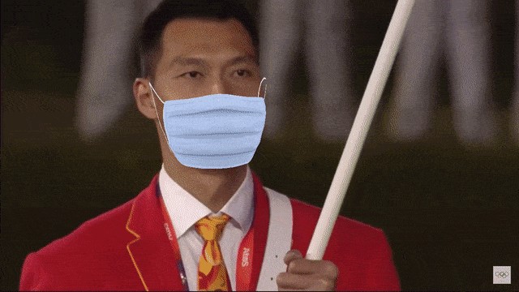

# Pose Filter

This document introduces the pose filter in FFmpeg GPU Demo. The pose filter is the core of our project, as it shows how to combine graphics rendering and DL inference in ffmpeg. The pose filter can render a medical mask on every human face in the frame, shown as Fig 1.

 |
|:--:|
| *Fig 1 Clip rendered by pose filter* |


## Compilation

The pose filter depends on the following libraries
* libtorch >= 1.9.1
* torchvision >= 0.11.1
* onnxruntime-gpu 1.8.1
* Eigen 3.4.0
* EGL
* OpenGL
* Assimp
* libsdl2
* CUDA >= 11.0

### Using containers
As you can see, the dependency is complicated, so we provided a Dockerfile for you to conveniently build a container image which contains all the dependencies. The Dockerfile is located in the root folder of ffmpeg-gpu-demo. Our image is based on the PyTorch image on [NGC containers](https://catalog.ngc.nvidia.com/orgs/nvidia/containers/pytorch), so pull the PyTorch image first
```bash
docker pull nvcr.io/nvidia/pytorch:22.03-py3
```
then build our image
```bash
cd ffmpeg-gpu-demo
docker build -t ffmpeg-gpu-demo:22.03-py3 --build-arg TAG=22.03-py3 .
```
Make sure TAG is the pytorch container tag. Grab a tea and wait for the build to complete. Once completed, run the container
```bash
docker run --gpus all -it --rm -e NVIDIA_DRIVER_CAPABILITIES=all -v $(pwd):/workspace/ffmpeg-gpu-demo ffmpeg-gpu-demo:22.03-py3
```
Then we can build the ffmpeg with the pose filter.
```bash
cd ffmpeg-gpu-demo/ffmpeg-gpu/
bash config_ffmpeg_libtorch.sh
make -j10
make install
```

### Without containers (Optional)
It is also possible to manually install all the dependencies if you do not want containers. Please refer to the Dockerfile for installing commands (after the `RUN` instruction in Dockerfile). In this case, you can install pytorch using pip, the include and lib locations can be check with:
```bash
python -c "import torch; print(torch.__path__[0] + '/lib')"
python -c "import torch.utils.cpp_extension as C; print(C.include_paths())"
```
But you need to build torchvision manually to use the C++ API. Refer to torchvision's GitHub repo for building torchvision. Make sure use the corresponding version to your libtorch.

## Run the filter

We used the [img2pose](https://github.com/vitoralbiero/img2pose) model to estimate human head pose. Download the [img2pose model](https://drive.google.com/file/d/1OvnZ7OUQFg2bAgFADhT7UnCkSaXst10O/view) and unzip the model. The img2pose model can be run directly by onnxruntime, no need to convert. Also, remember to put the rendering assets (medmask/) in the directory where you call `ffmpeg`, e.g. the root folder of ffmpeg.

Command to run the pose filter
```bash
ffmpeg -hwaccel cuda -hwaccel_output_format cuda -i ../output/rio.mp4 –vf scale_npp=1280:720,pose="img2pose.onnx" -c:v h264_nvenc -preset p7 rio_out.mp4
```
As you can see, pose filter is also a GPU filter and can be used with other GPU filters such as scale_npp.